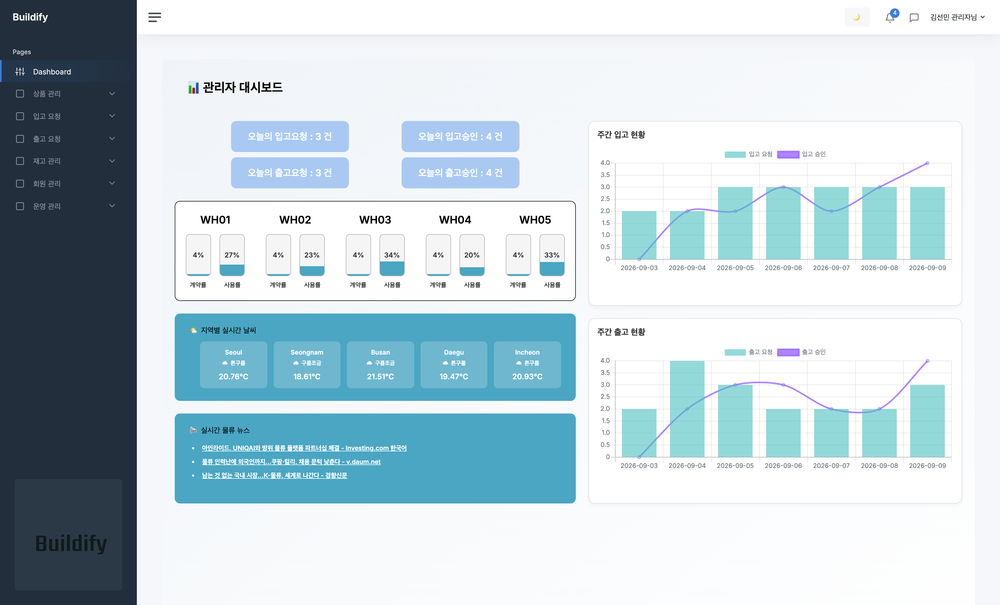
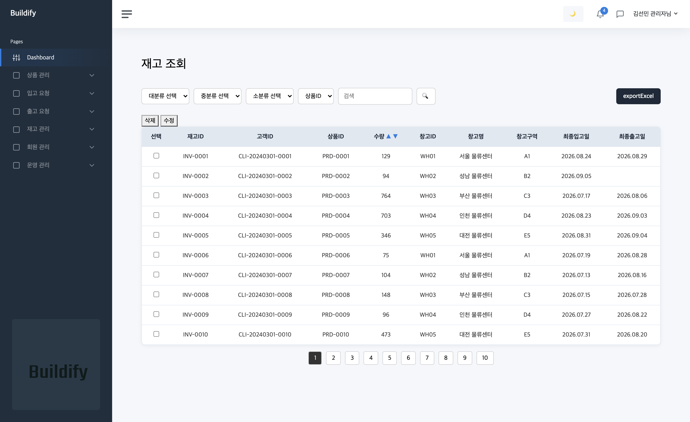
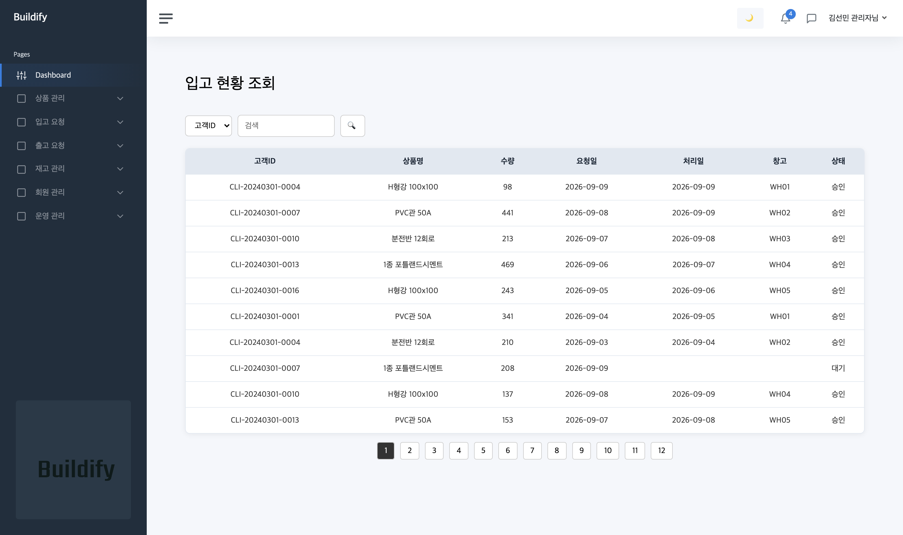
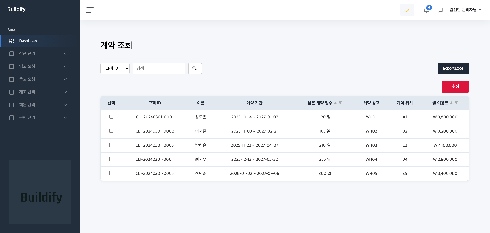
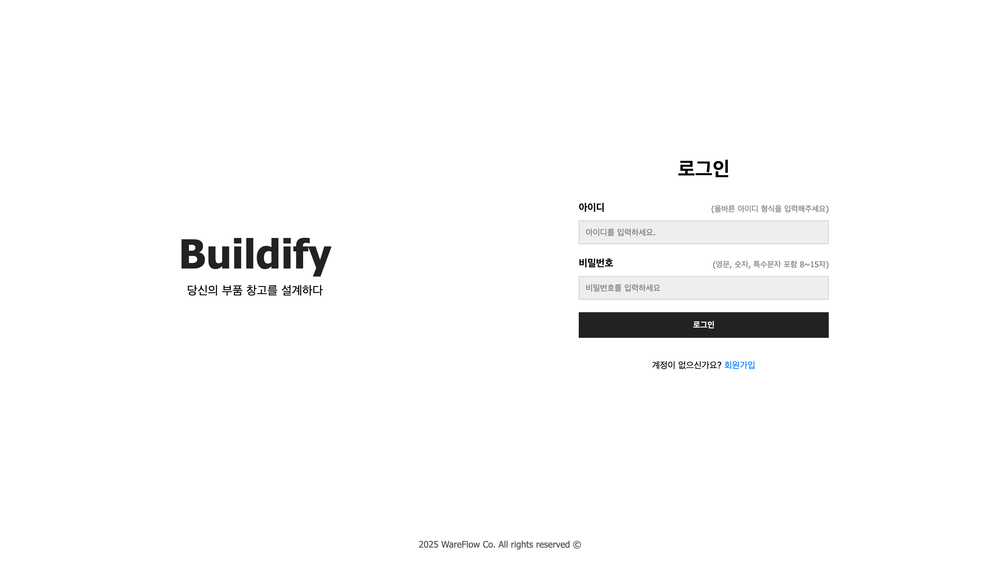

# WareFlow - 📦 BuildiFy - WMS 시스템 (2차 프로젝트)


창고 운영 전 과정을 웹으로 자동화·시각화하는 WMS(창고 관리 시스템)입니다.
**Docker 한 줄로 전체 환경이 재현되며, AWS EC2 에 실제 배포되어 있습니다.**

### 🔗 라이브 데모 — **https://buildify-wms.co.kr**

| 구분 | 계정 | 비밀번호 |
|------|------|----------|
| 관리자 | `admin01` | `admin1234!` |
| 사용자 | `user01` ~ `user20` | `user1234!` |

> 데모 서버는 비용 절감을 위해 상시 가동하지 않습니다.
> 접속되지 않으면 아래 [화면 미리보기](#-화면-미리보기)로 확인하실 수 있고,
> 필요하시면 연락 주시면 기동해 드립니다.

### 로컬에서 실행

```bash
cp .env.example .env && docker compose up -d --build   #  http://localhost:8080
```

MySQL 을 따로 설치할 필요 없이 데모 데이터(상품 100 · 재고 100 · 입고 120 · 출고 100 · 회원 20)까지 자동으로 준비됩니다.

<br>

## 목차  
1.	[프로젝트 개요](#프로젝트-개요)  
2.	[화면 미리보기](#-화면-미리보기)
3.	[기술 스택](#기술스택)
4.	[배포 환경](#배포환경)
5.	[프로젝트 구조](#프로젝트구조)
6.	[ERD](#ERD)
7.	[프로젝트 실행 가이드](#프로젝트-실행-가이드)
8.	[주요 기능](#주요-기능)
9.	[Trouble-Shooting](#trouble-shooting)
10.	[팀원](#팀원)
11.	[커밋·PR·이슈 컨벤션](#커밋pr이슈-컨벤션)
12.	[메서드 네이밍 규칙](#메서드명-네이밍-규칙-spring-project)
13.	[프로젝트 요약](#프로젝트요약)


## 프로젝트개요
 BuildiFy WMS(창고 관리 시스템)는 물류센터의 **입·출고 요청부터 재고 현황 모니터링, 계약 관리, 보고서 생성**까지   
 창고 운영 전 과정을 웹 기반으로 자동화·시각화하는 시스템입니다.  
 
주요 목적은  
- 입·출고 처리 효율화  
- 실시간 재고 정확도 확보  
- 관리자용 대시보드를 통한 의사결정 지원  
- Excel 출력물 자동 생성
    
등을 통해 물류 운영 비용을 절감하고, 사용자 편의성을 극대화하는 것입니다.


---

## 🖥 화면 미리보기

> 아래 화면은 `docker compose up -d --build` 한 번으로 재현됩니다.
> 데모 데이터(상품 100 / 재고 100 / 입고 120 / 출고 100 / 회원 20)가 자동 적재됩니다.

### 관리자 대시보드
당일·주간 입출고 지표, 창고별 계약률/사용률, 물류 뉴스(구글 뉴스 RSS)를 한 화면에 제공합니다.



### 재고 조회
카테고리 3단계 필터·검색·정렬·페이징을 지원하며 Excel 내보내기가 가능합니다.



<details>
<summary>다른 화면 더 보기</summary>

### 입고 현황 조회
요청/승인/반려 상태와 처리일, 배정 창고를 함께 조회합니다.



### 창고 계약 조회
회원별 임대 계약 기간과 잔여 일수, 월 이용료를 관리합니다.



### 로그인
Spring Security 기반 인증, 역할(관리자/사용자)에 따라 진입 화면이 분기됩니다.



</details>

---


## 💡 기술스택

| 영역 | 사용 기술 |
|------|-----------|
| Language | Java 17 |
| Framework | Spring , MyBatis |
| DB | MySQL |
| View | JSP |
| Cache | Spring Singleton |
| Build Tool | Gradle |
| 기타 | Lombok , Spring Security |
<br>


---

## 🚀 배포환경

- 개발환경: Local (MacOS / Windows)
- 서버: Tomcat 9.X (`javax.servlet` 기반 — Tomcat 10 이상 미지원)
- DB: MySQL 8.x
- 컨테이너: Docker / Docker Compose
- 클라우드: AWS EC2 t3.micro (Amazon Linux 2023, ap-northeast-2)
- 도메인/HTTPS: Cloudflare (Full strict)

### 구성도

```
방문자 ──HTTPS──▶ Cloudflare ──HTTPS──▶ Caddy:443 ──HTTP──▶ Tomcat 9:8080
                  Universal SSL        Origin 인증서       ROOT.war
                  (자동 갱신)          (2041년까지)             │
                                                          MySQL 8.0
                                                        (127.0.0.1 바인딩)
```

평문 구간은 컨테이너 내부 네트워크뿐이며, 인터넷을 지나는 모든 구간은 TLS 로 보호됩니다.
인바운드는 **443(HTTPS)과 22(SSH, 고정 IP 제한)만** 개방합니다.

### 이 배포에서 다룬 문제

| 문제 | 해결 |
|------|------|
| Spring Boot 가 아닌 WAR 프로젝트 | Tomcat 9 이미지에 `ROOT.war` 배치 (fat JAR 방식 불가) |
| 설정을 `application-secret.properties` 에서만 읽음 | 컨테이너 시작 시 환경변수로 파일을 생성 (앱 코드 무수정) |
| 인스턴스 재시작 시 퍼블릭 IP 변경 | 부팅 시 Cloudflare DNS A 레코드 자동 갱신 (탄력적 IP 비용 회피) |
| RAM 1GB 에서 Gradle 빌드 | 스왑 4GB + 컨테이너별 메모리 상한 + JVM 힙 조정 |
| 앱 기동이 DB 초기화보다 빠름 | Compose healthcheck + `service_healthy` 조건 |

자세한 절차는 [docs/DEPLOY-AWS.md](docs/DEPLOY-AWS.md) 와 [docs/DOMAIN-HTTPS.md](docs/DOMAIN-HTTPS.md) 를 참고하세요.


---

## 📦 프로젝트구조

```
src/main/java/com.wareflow.buildify
├── cache              # 캐시
├── common             # 공통 기능 
├── config             # 설정 관련
├── constant           # 공통 상수
├── domain             # 도메인 계층 (Controller,Service,Mapper 등)
│   └── admin
│       └── inbound
│           └── controller
│           └── repository
│           └── service
│       └── ....
│   └── user
│       └── ....
├── dto                # 요청/응답 DTO
├── exception          # 예외 처리
├── mysql              
├── temp               # 임시 작업용
├── util               # 공통 유틸 클래스
└── vo                 # DB 통신 VO


src/main/resources
├── application-secret.properties   # 민감한 설정 (DB 비밀번호, 보안 키 등)
├── log4j2.xml                      # log4j2 설정 파일
├── config                          # 설정 파일
│   ├── mybatis-config.xml          # mybatis 설정 파일
├── mappers                        # Mapper 
│   ├── admin/                     # 관리자용 mapper
│   ├── users/                     # 고객용 mapper
└───└── auth/                      # 로그인용 mapper

src/main/webapp
├── static                          # 정적 파일(css, js, 이미지 등)
│   ├── css/
│   ├── fonts/
│   ├── img/
│   └── js/
├── WEB-INF
│   ├── root-context.xml
│   ├── servlet-context.xml
│   ├── web.xml
│   └── views
│   │   ├── admin/                    # 관리자 페이지
│   │   │      ├── layouts/           # header/footer/sidebar 등 관리자 레이아웃
│   │   │      ├── pages/             # 관리자 구현 페이지 모음
│   │   │      │      ├── inbound/
│   │   │      │      ├── outbound/
│   │   │      │      ├── ...                
│   │   ├── users/                    # 유저 페이지
│   │   │      ├── layouts/           # header/footer/sidebar 등 관리자 레이아웃
│   │   │      ├── pages/             # 유저 구현 페이지 모음
│   │   │      │      ├── inbound/
│   │   │      │      ├── outbound/
│   │   │      │      ├── ...           
└───└───└── common/
│   │   │      ├── pages/             
└───└───└──────└──────└── errorpage/  # 커스텀 에러페이지 구현

```
---

## ERD


---

## 프로젝트 실행 가이드

### 방법 A. Docker 로 실행 (권장)

MySQL 설치 없이 앱 + DB 를 한 번에 띄웁니다. **필요한 것은 Docker 뿐입니다.**

```bash
git clone <repo-url>
cd Buildify_Phase-2

cp .env.example .env      # DB 비밀번호 등을 채워 넣습니다
docker compose up -d --build
```

기동 후 <http://localhost:8080> 접속.

| 구분 | 계정 | 비밀번호 |
|------|------|----------|
| 관리자 | `admin01` (그 외 `admin02`, `admin03`) | `admin1234!` |
| 사용자 | `user01` ~ `user20` | `user1234!` |

> 데모 데이터(상품 100 / 재고 100 / 입고 120 / 출고 100 / 회원 20)가 자동으로 적재됩니다.
> 날짜는 실행 시점 기준 상대값이라 언제 띄워도 대시보드 통계가 채워집니다.

**구성**

| 파일 | 역할 |
|------|------|
| `Dockerfile` | Gradle 빌드 → Tomcat 9 이미지에 `ROOT.war` 배치 (Boot 가 아니라 WAR 방식) |
| `docker-compose.yml` | 앱 + MySQL 8.0, DB healthcheck 후 앱 기동 |
| `docker/entrypoint.sh` | 환경변수 → `application-secret.properties` 생성 |
| `docker/mysql/init/01-schema.sql` | 테이블 DDL |
| `docker/mysql/init/02-seed.sql` | 데모 시드 데이터 |
| `docker/mysql/init/03-objects.sql` | 뷰 / 프로시저 / 트리거 |

**자주 쓰는 명령**

```bash
docker compose logs -f app      # 앱 로그
docker compose down             # 중지 (데이터 유지)
docker compose down -v          # 중지 + DB 초기화 (시드 다시 적재)
```

> DB 초기화 스크립트는 **볼륨이 비어 있을 때 최초 1회만** 실행됩니다.
> 시드를 다시 넣으려면 `docker compose down -v` 후 다시 올리세요.

### 방법 B. 로컬 Tomcat 으로 실행

1. **환경 준비** — JDK 17, MySQL 8.x, **Tomcat 9.x**
   (`javax.servlet` 기반이라 Tomcat 10 이상에서는 동작하지 않습니다)

2. **DB 준비**

   ```bash
   mysql -u root -p -e "CREATE DATABASE buildifydb DEFAULT CHARACTER SET utf8mb4;"
   mysql -u root -p buildifydb < docker/mysql/init/01-schema.sql
   mysql -u root -p buildifydb < docker/mysql/init/02-seed.sql
   mysql -u root -p buildifydb < docker/mysql/init/03-objects.sql
   ```

3. **설정 파일 작성** — `src/main/resources/application-secret.properties`
   (이 파일은 `.gitignore` 대상이며 **절대 커밋하지 않습니다**)

   ```properties
   application-secret.driver=com.mysql.cj.jdbc.Driver
   application-secret.url=jdbc:mysql://localhost:3306/buildifydb?serverTimezone=Asia/Seoul&characterEncoding=UTF-8
   application-secret.username=YOUR_DB_USER
   application-secret.password=YOUR_DB_PASSWORD

   # 외부 API 키 (비워 두면 해당 기능만 비활성화되고 기동은 정상)
   kakao.rest.key=
   kakao.javascript.key=
   openweather.api.key=
   news.api.key=
   ```

4. **빌드 및 배포**

   ```bash
   ./gradlew clean war
   # build/libs/buildify-wms-0.0.1-SNAPSHOT.war 를
   # Tomcat 의 ROOT 컨텍스트(/)로 배포합니다.
   ```

   > 로그인 성공 후 `/admin/pages/index` 처럼 루트 기준 절대경로로 리다이렉트하므로
   > **반드시 ROOT 컨텍스트(`/`)로 배포**해야 합니다.

5. **테스트 실행**

   ```bash
   ./gradlew test
   ```

   > 테스트는 `root-context.xml` 을 직접 로드하므로 **실행 중인 MySQL 이 필요합니다.**
   > DB 없이 빌드하려면 `./gradlew war -x test` 를 사용하세요.

---

## 🛠 주요 기능
 1. 인증·인가  
	•	Spring Security 기반 로그인/로그아웃  
	•	관리자(Admin) / 사용자(User) 역할별 접근 제어  

2. 입고 관리 (Inbound)  
	•	입고 요청 등록·조회·수정  
	•	관리자 승인·반려 처리  
	•	Excel 리포트 자동 생성
	•	재고 및 입고 이력 실시간 업데이트  
   
4. 출고 관리 (Outbound)  
	•	출고 요청 등록·조회·수정·삭제  
	•	관리자 승인·반려 처리
	•	Excel 리포트 자동 생성  
	•	재고 및 출고 이력 실시간 업데이트  

6. 재고 현황  
	•	재고 현황 조회    
	•	재고 카테고리 별 조회  

7. 계약 관리  
	•	창고 임대 계약 등록·갱신  
	•	계약 기간 체크  
	•	계약별 고객 정보 관리  

8. 대시보드  
	•	관리자용 홈 화면  
	•	JavaScript 기반 차트(JSP+Chart.js)로 시각화  
	•	5분 단위 자동 리프레시  

9. 공통  
	•	글로벌 예외 처리(@ControllerAdvice) 및 커스텀 에러 페이지  
	•	Spring Singleton 캐시 활용  

10. 보안·성능  
	•	MyBatis 성능 튜닝(동적 SQL, 페이징)   
	•	트랜잭션 관리 및 롤백 보장(@Transactional)  


---

## Trouble-Shooting


- Spring Security 인증 객체 문제 -> 객체 생성 통해 해결
- AJAX 비동기 처리 -> AJAX기반 카테고리 조회 실패, @ResponseBody 사용해 JSON 데이터를 반환하여 해결

---

## 👥 팀원
- [**김선민**](https://github.com/seonmin12)
- [**김성준**](https://github.com/kimsj18)
- [**이동휘**](https://github.com/DH-CaseStudy)
- [**신민혁**](https://github.com/minhyeokshin)

---

## 🧾 커밋, PR, 이슈 컨벤션
<br>

### ✅ 커밋 메시지 규칙

```
[이모지] 타입 : 간단한 요약

- 상세 설명 1
- 상세 설명 2 (선택)
```

| 이모지 | 타입       | 설명                         |
|--------|------------|------------------------------|
| ✨     | feature    | 새로운 기능 추가             |
| 🐛     | fix        | 버그 수정                    |
| ♻️     | refactor   | 코드 리팩토링                |
| 📝     | docs       | 문서 수정 (README 등)        |
| 💄     | style      | 코드 스타일 변경 (세미콜론, 띄어쓰기 등) |
| ✅     | test       | 테스트 코드 추가/수정        |
| 🔧     | chore      | 빌드, 설정 관련              |
| 🚀     | perf       | 성능 개선                    |
| 🔥     | remove     | 코드 삭제                    |
| 🚧     | wip        | 작업 중 (Work in progress)   |
| 🗃️     | db         | DB 관련 작업 (스키마 등)     |
| 🔀     | merge      | 브랜치 병합                  |
| 🐳     | docker     | 도커 관련 작업               |
| 🔒     | security   | 보안 관련 수정               |


---

### 📦 PR 템플릿

```md
### 🔧 작업 내용
- [ ] 작업 요약

### 📌 참고 사항
- [ ] 참고할 점
```

---

### 📌 이슈 템플릿

```md
### 📌 이슈 내용 
간단한 설명

### ✅ 작업 항목
- [ ] 할 일 1
- [ ] 할 일 2

### 💬 참고
예상되는 영향이나 고민
```

## 📌 메서드명 네이밍 규칙 (Spring Project)
- 조회: get / find / fetch
- 등록: create / save / register / add
- 수정: update / modify
- 삭제: delete / remove
- 검증: check / validate / exists
- 처리: process / handle
→ 반환되는 타입과 목적에 따라 일관성 있게 작성

📌 예시
- UserService
  - getUserById(Long id)
  - createUser(UserDTO dto)
  - updateUser(UserDTO dto)
  - deleteUser(Long id)

 ---

## 🏁 프로젝트요약
BuildiFy WMS는 단순한 CRUD를 넘어  
**재고 관리, 계약 관리, 대시보드 시각화까지 통합**한  
**실전형 창고 관리 시스템**입니다.

Spring MVC 구조 기반으로 **트랜잭션 통제, 비동기 처리, 성능 최적화**를 반영했으며,  
Git 협업 규칙과 코드 컨벤션을 준수하여 **팀 단위 개발 경험**을 강화했습니다.

본 프로젝트를 통해  
**"백엔드 개발자로서 구조적 설계와 협업 능력"**  
모두를 성장시킬 수 있었습니다.

---

## 📝 프로젝트 회고

이번 프로젝트를 진행하면서 여러 가지 의미 있는 경험을 할 수 있었습니다.

### ✅ Spring MVC 구조에 대한 이해

- 이번 웹 프로젝트를 통해 Spring MVC 구조를 실제로 적용해보며 **Controller, Service, Repository 계층의 역할과 흐름**을 명확히 이해할 수 있었습니다.
- 모듈러 모놀리식(Modular Monolith) 구조를 채택해 **도메인별로 명확하게 패키지를 분리**하였고, 이를 통해 구조적 안정성과 유지보수 측면에서 장점을 느낄 수 있었습니다.

### ✅ 외부 기능 연동 경험

- 직접 구현하지는 않았지만, Spring Security를 적용한 팀원의 작업을 보며 **로그인 시 인증(Authentication)과 인가(Authorization)** 과정이 어떻게 이루어지는지 흐름을 파악할 수 있었습니다.
- 카카오 지도 API, 엑셀 파일 다운로드 기능 등 **외부 API 연동 방식과 흐름**을 파악하고 직접 적용해보며 실전 경험을 쌓을 수 있었습니다.

### ✅ AJAX를 활용한 UX 개선 시도

- **AJAX를 사용한 비동기 처리**로 사용자 경험을 개선하고자 시도했지만, 처음 해보는 작업이라 쉽지 않았습니다.
- 예상치 못한 오류들과 프론트엔드 기술 부족으로 인해 간단한 기능도 구현에 시간이 오래 걸렸지만, 이 과정이 **프론트엔드 기술에 대한 학습 동기**로 이어졌습니다.

### ✅ 팀 프로젝트에 대한 아쉬움

- 프로젝트 마무리에만 집중한 나머지, **구조 설계나 학습적인 소통이 부족했던 점**이 아쉬움으로 남습니다.
- 구조를 함께 설계하고 공부해가며 진행했다면 더욱 효율적이고 배움도 컸을 것이라는 생각이 듭니다.

### ✅ 앞으로의 방향

- 이번 프로젝트는 저의 **첫 번째 웹 프로젝트**였으며, 여러 시행착오 속에서도 많은 배움을 얻었습니다.
- 부족한 부분은 채워가고, 앞으로 더 발전해나가는 개발자가 되겠습니다.
